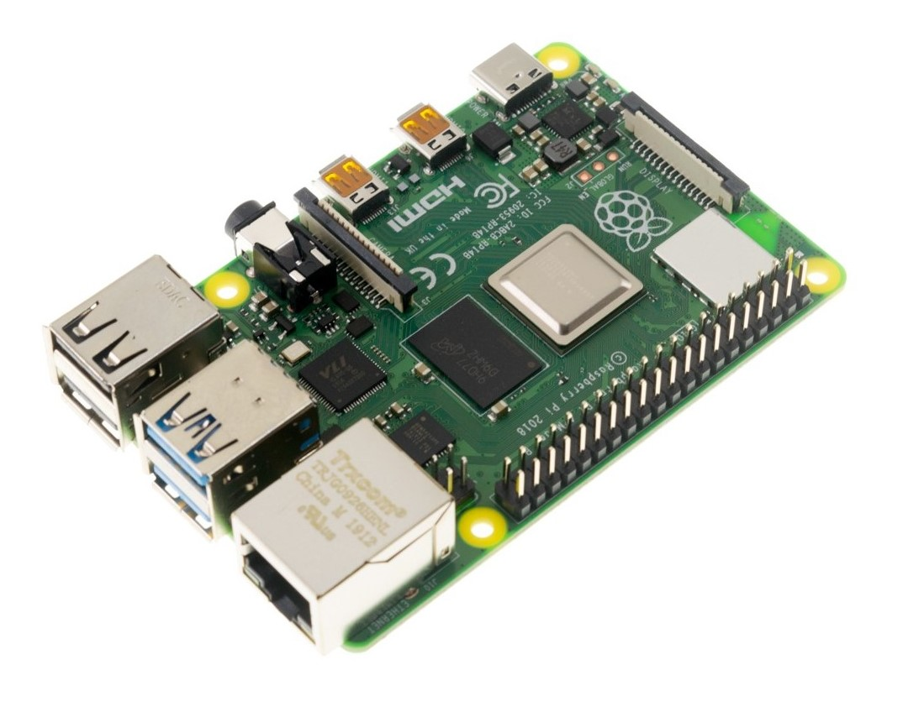
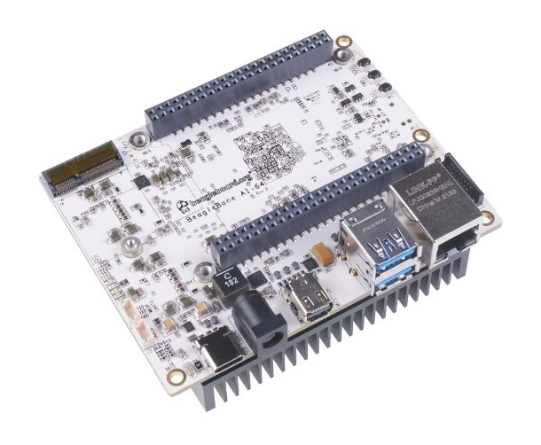
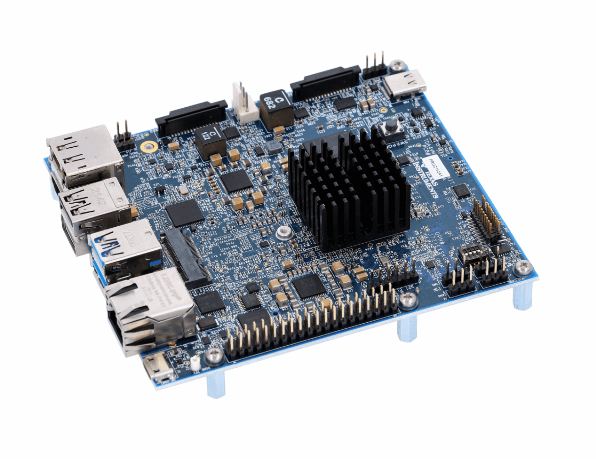

To use Viam software with your robot, you need to install and run a binary called `viam-server` on the computer you want to use to control the robot.
See [What is Viam?](/viam/) for more information.

## Preparation

Make sure your system is compatible with Viam.
Viam is supported on:

- Linux 64-bit operating systems
- macOS

If you are using a single board computer (SBC) or a microcontroller, prepare your device by following the relevant setup document:

  

    

        <a href="prepare/rpi-setup/">
            
            <h4 style="text-align: left; margin-left: 0px; font-weight:bold">Raspberry Pi</h4>
        <a>
    

    

        <a href="prepare/beaglebone-setup/">
            
            <h4 style="text-align: left; margin-left: 0px; font-weight:bold">BeagleBone AI-64</h4>
        </a>
    

    

        <a href="prepare/sk-tda4vm/">
            
            <h4 style="text-align: left; margin-left: 0px; font-weight:bold">Texas Instruments SK-TDA4VM</h4>
        </a>
    

    

        <a href="prepare/jetson-nano-setup/">
            
            <h4 style="text-align: left; margin-left: 0px; font-weight:bold">Jetson Nano</h4>
        </a>
    

    

        <a href="prepare/jetson-agx-orin-setup/">
            
            <h4 style="text-align: left; margin-left: 0px; font-weight:bold">Jetson AGX Orin</h4>
        </a>
    

      

        <a href="prepare/microcontrollers">
            
            <h4 style="text-align: left; margin-left: 0px; font-weight:bold">Expressif ESP32</h4>
        </a>
    

  

  

    

        
        

             
            
 If you plan to run <code>viam-server</code> on your laptop or desktop with a Linux or Mac operating system, no special prep is required. Proceed to <a href="#installation">Installation</a>. 

        

    

## Installation

  

    

      <a href="install">
        
        <h4 style="text-align: left; margin-left: 0px">Install</h4>
        

          Install <code>viam-server</code> on your robot's computer.
        

      </a>
    

  

## Next Steps

  

    

      <a href="manage">
        
        <h4 style="text-align: left; margin-left: 0px">Manage</h4>
        

          Control and troubleshoot <code>viam-server</code>.
        

      </a>
    

    

      <a href="update">
        
        <h4 style="text-align: left; margin-left: 0px">Update</h4>
        

          Keep your version of <code>viam-server</code> up to date.
        

      </a>
    

  

